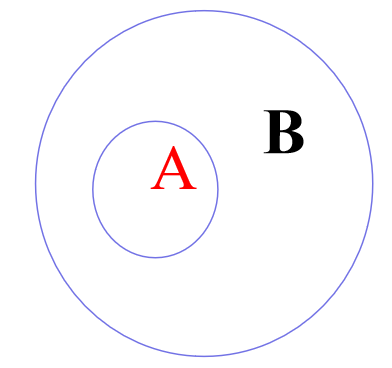

### 集合的表示方法

列举法
集合列举法常用于表示有限集合，把集合中的所有元素一一列举出来（一般不考虑元素的前后顺序）例如: {1,2,3}。 

 
描述法
常用于表示无限集合，把集合中元素的公共属性用文字﹐符号或式子等描述出来﹐写在大括号内﹐这种表示集合的方法叫做描述法。例如: <math xmlns='http://www.w3.org/1998/Math/MathML'> <mo> { </mo> <mi> x </mi> <mo> | </mo> <mn> 10 </mn> <mo> &lt; </mo> <mi> x </mi> <mo> &lt; </mo> <mn> 20 </mn> <mo> , </mo> <mi> x </mi> ∈ <mi> z </mi><mo>}</mo> </math>。

---
### 子集的定义

 一般地,对于两个集合A与B，如果集合A中的任何一个元素都是集合B的元素,我们就说这两个集合有包含关系，称集合A为集合B的子集（subset）。
记作A⊆B（或B⊆A），读作“A含于B”,或“B包含A”。

#### Venn图 A⊆B

<h3>注意: </h3>

有两种可能
（1）A是B的一部分；
（2）A与B是同一集合 

---

### 集合的相等

一般地,对于两个集合A与B,如果集合A中的任何一个元素都是集合B的元素,同时集合B中的任何一个元素都是集合A的元素,则称集合A等于集合B,记作A=B

---

### 真子集的定义

对于两个集合A与B,如果A⊆B,但存在元素 x∈A且x∉A,则称集合A是集合B的真子集(proper subset)．记作A⫋B

---

### 几个结论

①空集是任何集合的子集Φ ⊆ A
②空集是任何非空集合的真子集Φ⫋A（A ≠ Φ） 
③任何一个集合是它本身的子集，即 A⊆A
④对于集合A，B，C，如果 A ⊆B,且B⊆C，则A⊆C

---

<h3>注意易混符号: </h3>
①“∈ ”与“⊆”：元素与集合之间是属于关系；集合与集合之间是包含关系如: 1∈N,-1∉N,N⊆R。Φ⊆R,{1} ⊆{1，2，3}。

②{0}与Φ：{0}是含有一个元素0的集合，Φ是不含任何元素的集合如 Φ⊆{0}不能写成Φ={0}，Φ∈{0}。

---

<h3>重要结论: </h3>
结论：含n个元素的集合的所有子集的个数是2^n（2的n次方），
所有真子集的个数是2^n-1（2的n-1次方），非空真子集数为2^n-2（2的n-2次方）。

---